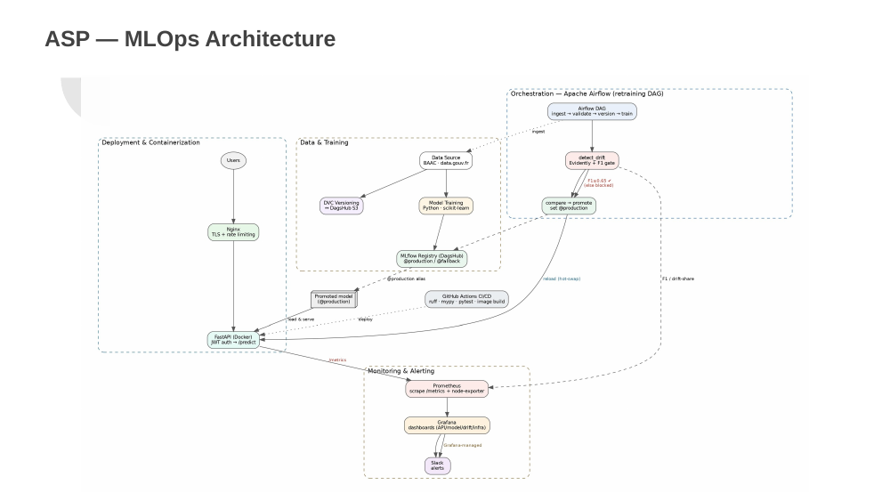

# Crash Severity Predictor

**End-to-end MLOps pipeline that predicts road-accident injury severity from French open government data (ONISR / BAAC).**


-success)


> **Origin & credit:** This project began as a 4-person MLOps capstone. This repository is my
> continued, independently-maintained version. On the original build, my ownership was **workflow
> orchestration (Airflow), drift detection & the F1 quality gate, and monitoring & alerting
> (Prometheus / Grafana / Slack)**. Ongoing improvements here are my own — see the
> [Roadmap](#roadmap).

---

## What it does

Given the circumstances of a road accident (road type, speed limit, lighting, safety equipment,
road-user type, location, …), the service predicts whether a casualty is **lightly** vs
**severely / fatally** injured — and wraps that model in a full production stack: automated
retraining, drift-gated promotion, a registry-backed API, and live monitoring.

| | |
|---|---|
| **Data** | ONISR / BAAC open data, ~**182,680** accident records, **2021–2023** (2024 held out for drift) |
| **Target** | Binary injury severity — `0` light · `1` severe/fatal (≈ 65/35 imbalance) |
| **Model** | `RandomForestClassifier` (100 trees, depth 20), top-20 predictive features |
| **Headline metric** | **F1 ≈ 0.69** on the severe class · promotion **quality gate at 0.65** |
| **Tests** | **241** automated tests across 35 files |

## Architecture



The pipeline is orchestrated by a single Airflow DAG and runs each step as an isolated container:

```
ingest → build dataset → validate → version (DVC) → train + log (MLflow)
       → drift & F1 gate (Evidently) → compare champion → promote → reload API
```

## Key design decisions

- **Drift-gated promotion.** A retrained model is promoted to `@production` **only if** it beats the
  current champion **and** clears an absolute F1 floor of **0.65** — relative progress *and* absolute
  quality, so "better than a degraded champion" can never ship an unsafe model.
- **Registry over files.** MLflow (on DagsHub) with alias-based versioning (`@production` /
  `@fallback`) enables champion/challenger comparison and one-step rollback.
- **Reproducible data.** DVC versions each dataset; the pipeline records the exact data state used
  for every training run.
- **Secure serving.** FastAPI with JWT auth behind an NGINX TLS reverse proxy + rate limiting;
  hot model reload without downtime.
- **Observability.** Prometheus scrapes model + service metrics; 4 Grafana dashboards (API health,
  model, drift & quality gate, infrastructure); Slack alerting on backend-down, high 5xx, and low F1.

## Tech stack

`Python` · `scikit-learn` · `Airflow` · `MLflow` · `Evidently` · `DVC` · `FastAPI` · `Docker` ·
`NGINX` · `Prometheus` · `Grafana` · `GitHub Actions`

## Quickstart

```bash
# 1. environment (uv)
uv sync

# 2. secrets — copy the examples and fill in your own values
cp infra/airflow/.env.example infra/airflow/.env
#   create .env / .env.backend / .env.grafana with your DagsHub token, admin hash, Slack webhook

# 3. bring up the stack
docker compose up -d --build
docker compose ps            # wait for healthy

# 4. try the API
curl -sk https://asp.local:8081/api/v1/health
```

Monitoring is at `https://asp.local:8081/grafana/`. See [`docs/`](docs/) for the full walkthrough.

## Roadmap

- [ ] **Dataset lineage** — stamp the DVC hash + git SHA into every MLflow run for one-click reproducibility.
- [ ] **`/explain` endpoint** — per-prediction SHAP explanations.
- [ ] **LLM-plain-language predictions** — turn SHAP output into a human-readable rationale.
- [ ] **Model card** — documented intended use, metrics by segment, and limitations.
- [ ] **Kubernetes** — autoscaling + canary/shadow deployment.

## License & credits

See [`LICENSE`](LICENSE). Built on French government open data published by ONISR / BAAC via
[data.gouv.fr](https://www.data.gouv.fr/). Originally a collaborative capstone; this fork is
maintained by **Nithin R. Karkal** — *Simulation Engineer × ML Engineer*.
